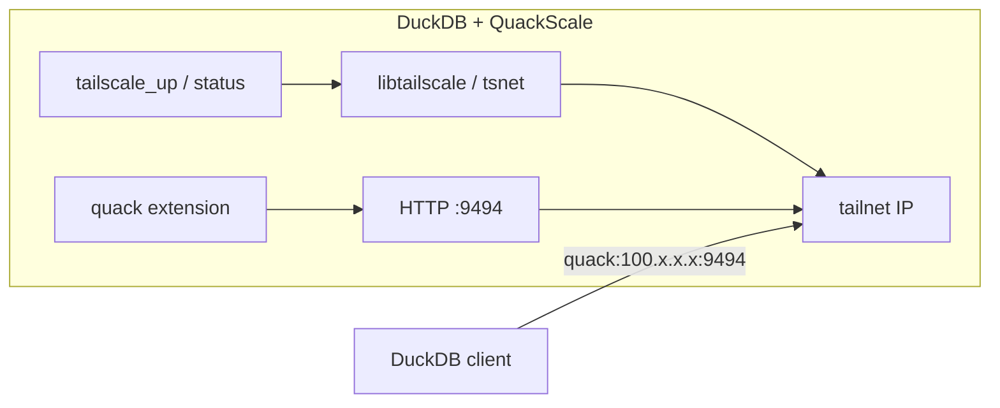

# QuackScale — Research & Implementation Plan

QuackScale is a DuckDB **community extension** that embeds [libtailscale](https://github.com/tailscale/libtailscale) so a DuckDB process can join a tailnet and expose (or reach) the [Quack](https://duckdb.org/docs/current/quack/overview) remote protocol on tailnet addresses instead of only localhost.

## Problem

[Quack](https://duckdb.org/docs/current/quack/overview) turns DuckDB into an HTTP server (`quack_serve`) so other DuckDB clients can `ATTACH` or run `quack_query` remotely. By default, `quack_serve` only binds **localhost** unless `allow_other_hostname => true`, and production setups typically use a TLS reverse proxy.

For private teams, binding Quack on a **Tailscale IP** gives:

- Encrypted tailnet transport without exposing the service on the public internet
- Stable reachability via MagicDNS / tailnet IPs
- No custom wire protocol — Quack stays HTTP + `application/duckdb`

QuackScale does **not** reimplement Quack. It brings the process onto the tailnet; Quack remains the core `quack` extension.

## Architecture



### Component roles

| Component | Role |
|-----------|------|
| **libtailscale** | Userspace Tailscale (tsnet): auth, tailnet IP, listen/dial on tailnet |
| **QuackScale** | C++ extension: lifecycle SQL API, tailnet IP → `quack:` URI helpers |
| **Quack (core)** | HTTP server, serialization, attach/catalog — unchanged |

### Target user flow (phase 1 — manual compose)

```sql
LOAD quack;
LOAD quackscale;

-- Join tailnet (authkey via env/secret in production)
CALL tailscale_up(authkey => 'tskey-auth-...', hostname => 'analytics-duck-1');

-- Advertise Quack on the tailnet (default port 9494)
CALL quack_discover();

-- Expose Quack on tailnet with shared token (env: QUACK_TAILNET_TOKEN)
CALL quack_serve(
    quack_uri(),
    allow_other_hostname => true,
    token => quack_token()
);

-- Remote client: same token via CREATE SECRET or TOKEN (see QUACK_AUTH.md)
ATTACH 'quack:analytics-duck-1:9494' AS remote (TYPE quack, DISABLE_SSL true);
```

Phase 2 may add `quackscale_serve()` that chains up + `quack_serve` in one call (needs stable inter-extension hooks or documented SQL orchestration).

## Authentication (two layers)

| Layer | Doc |
|-------|-----|
| **Tailscale** (node on tailnet) | [AUTHENTICATION.md](AUTHENTICATION.md) — `TS_AUTHKEY`, `CALL tailscale_up`, browser login |
| **Quack** (SQL over HTTP) | [QUACK_AUTH.md](QUACK_AUTH.md) — `QUACK_TAILNET_TOKEN`, `quack_token()`, `CREATE SECRET`, `quack_authentication_function` |

QuackTail fleets should use a **shared Quack token** (or allowlist), not per-server random `auth_token` values from `quack_serve`. See [Quack — Overriding authentication](https://duckdb.org/docs/current/quack/security#overriding-authentication).

## libtailscale integration notes

- Built with `go build -buildmode=c-archive` → `libtailscale.a` + generated header (see [libtailscale README](https://github.com/tailscale/libtailscale)).
- C API: `tailscale_new`, `tailscale_up`, `tailscale_getips`, `tailscale_listen` / `tailscale_dial`, etc. ([`tailscale.h`](https://github.com/tailscale/libtailscale/blob/main/tailscale.h)).
- **Build requirement**: Go toolchain + CGO; CMake option `QUACKSCALE_WITH_TAILSCALE` (default ON).
- **CI implication**: extension distribution jobs must install Go; first bootstrapped CI may only run tests that do not call `tailscale_up` without credentials.

### Risks

| Risk | Mitigation |
|------|------------|
| Large binary (Go runtime) | Document size; optional `QUACKSCALE_WITH_TAILSCALE=OFF` stub build |
| macOS min OS (libtailscale Makefile targets 15.0 for some Swift paths) | CMake sets `MACOSX_DEPLOYMENT_TARGET=11.0` for archive build; validate in CI |
| Quack API churn (beta) | Pin DuckDB version; integration tests against pinned `quack` |
| Auth secrets in SQL | `TS_AUTHKEY` + `QUACK_TAILNET_TOKEN` via env/secrets; see [QUACK_AUTH.md](QUACK_AUTH.md) |

## Quack protocol recap (relevant bits)

From the [Quack overview](https://duckdb.org/docs/current/quack/overview):

- HTTP(S), default port **9494**, URI scheme `quack:host:port`
- Server: `CALL quack_serve('quack:...', allow_other_hostname => true, token => '...')`
- Client: `ATTACH 'quack:host' AS db (TOKEN '...', DISABLE_SSL true)` for tailnet HTTP without public TLS
- Token auth via secrets or explicit `TOKEN`

QuackScale’s job is **advertising** reachable **`quack:<host>:9494`** endpoints on the tailnet after `tailscale_up` — MagicDNS hostname first (for discovery), plus each tailnet IP.

## SQL API (bootstrapped)

| Function | Purpose |
|----------|---------|
| `CALL tailscale_status()` | Whether libtailscale is linked, running, hostname, tailnet IPs |
| `CALL tailscale_up(...)` | Join tailnet; named params: `hostname`, `authkey`, `control_url`, `state_dir`, `ephemeral` |
| `CALL quack_discover(port => 9494)` | All tailnet `quack:` URIs clients can use (default port **9494**) |
| `quack_uri()` | Scalar for `CALL quack_serve(quack_uri(), ...)` (hostname if set, else first IP; port **9494**) |
| `quack_token()` | Scalar — shared token from `QUACK_TAILNET_TOKEN` / `QUACK_TOKEN` env |

Planned:

- `tailscale_down()` — `tailscale_close`
- `quack_serve_on_tailnet(port, ...)` — orchestrate Quack when `quack` is loaded
- Settings: default port, auto-load `quack`, state directory
- [x] Headscale CI smoke (`scripts/ci_headscale_smoke.sh`, `.github/workflows/headscale-integration.yml`)
- [x] Two-node QuackTail e2e over Headscale ([`scripts/ci_headscale_e2e.sh`](../scripts/ci_headscale_e2e.sh), [`.github/workflows/headscale-e2e.yml`](../.github/workflows/headscale-e2e.yml))

## Repository layout

```
duckdb_tailscale/
├── cmake/Libtailscale.cmake    # Go c-archive build
├── third_party/libtailscale/   # git submodule
├── src/
│   ├── quackscale_extension.cpp
│   └── tailscale_bridge.cpp
├── docs/PLAN.md
├── test/sql/quackscale.test
└── duckdb/ + extension-ci-tools/  # submodules
```

## Community extension checklist

- [x] Fork/bootstrap [extension-template](https://github.com/duckdb/extension-template)
- [x] Rename to `quackscale`
- [x] libtailscale submodule + CMake
- [ ] Green `make` / `make test` locally
- [ ] Add Go to GitHub Actions (custom step or workflow env)
- [ ] PR to [community-extensions](https://github.com/duckdb/community-extensions) descriptor
- [ ] README: install `INSTALL quackscale FROM community` + Quack dependency docs
- [ ] Security section: tailnet ACLs, tokens, no Funnel unless explicit

## Phased delivery

1. **Bootstrap (current)** — template, libtailscale link, status/up/uri SQL, plan doc
2. **Quack glue** — docs + example script; optional `quackscale_serve` wrapper
3. **CI hardening** — Go in matrix, optional e2e with test auth key
4. **Community release** — descriptor, versioning aligned with DuckDB 1.5.x + Quack beta
